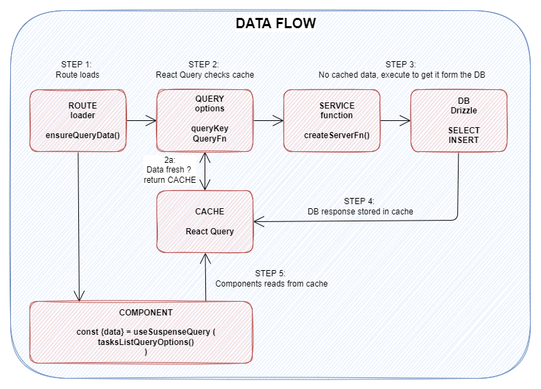
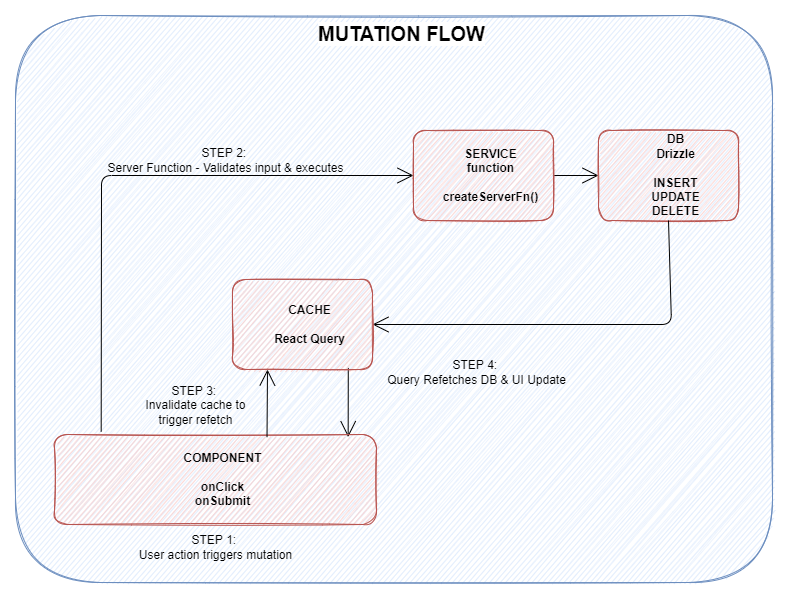

# Better Tasks - TanStack Start

A task management application built with TanStack Start, featuring a pragmatic **Feature-First Colocation** architecture.

> Originally based on [this YouTube tutorial](https://www.youtube.com/watch?v=KsHbs5RMVYU), now evolved into a standalone project demonstrating modern full-stack patterns with TanStack.

Based on the tutorial, first a POC is build to understand the tech used, and then an alpha version will be released to serve two purposes:

- a standalone web application
- a partially packaged module to be distributed as a npm package and integrated into the up4it application

---

## Technical Stack

| Technology                                     | Version | Purpose                   |
| ---------------------------------------------- | ------- | ------------------------- |
| [TanStack Start](https://tanstack.com/start)   | 1.132.0 | Fullstack React framework |
| [TanStack Router](https://tanstack.com/router) | 1.132.0 | Type-safe routing         |
| [TanStack Query](https://tanstack.com/query)   | 5.84.2  | Data fetching & caching   |
| [Better Auth](https://www.better-auth.com/)    | 1.4.12  | Authentication            |
| [PostgreSQL](https://www.postgresql.org/)      | 16      | Database (Docker)         |
| [Drizzle ORM](https://orm.drizzle.team/)       | 0.45.0  | Type-safe ORM             |
| [Zod](https://zod.dev/)                        | 4.3.6   | Schema validation         |
| [shadcn/ui](https://ui.shadcn.com/)            | latest  | UI Components             |
| [Tailwind CSS](https://tailwindcss.com/)       | 4.1.18  | Styling                   |

---

## Project Status / TODO

### Features (Product)

- [x] Authentication (Better Auth)
- [x] Task CRUD operations
- [x] Todo CRUD operations (nested under tasks)
- [x] Drag & drop reorder for todos
- [x] React Query caching
- [ ] Email verification
- [ ] User profile management

### Chore (Internally)

- [x] Follow the YouTube tutorial (TanStack Start basics)
- [x] Feature-based architecture
- [x] Implement Better Auth and plugins
- [x] Implement input validators
- [x] Type-safe server functions
- [x] Zod input validation with transforms
- [x] `satisfies` pattern for type safety
- [x] Implement caching
- [x] Fix package json versions (It generates errors...)
- [ ] Add oRPC integration
- [ ] Add error handling
- [ ] Unit tests (Vitest)

---

## Architecture

This project follows a **Feature-Based Architecture** where each feature is self-contained with its own data models, services, queries, and components.

This choice has been made to embrace TanStack Start's full-stack philosophy while keeping code organized and maintainable.

### Why this Architecture Feature-Based?

| Reason          | Benefit                                                          |
| --------------- | ---------------------------------------------------------------- |
| **Colocation**  | All related code lives together (easier to find)                 |
| **Scalability** | Add features without touching other parts                        |
| **Type Safety** | End-to-end types from DB to UI                                   |
| **Caching**     | React Query handles client-side cache automatically              |
| **Pragmatic**   | No over-engineering. Simple structure with 3-4 files per feature |

> **Note**: Unlike the [Next.js sister project](https://github.com/...) which uses a full Layered Architecture (DAL/BLL/Actions), this project uses a lighter approach that fits TanStack Start's "full-stack by default" philosophy.

### Representation of the architecture

# TODO SCHEMA HERE

---

### Project Structure

```
src/
├── lib/
│   ├── auth/                     # Authentication (Better Auth)
│   │   ├── auth.ts               # Auth configuration
│   │   ├── auth.functions.ts     # Server functions ($getUser, $getSession)
│   │   ├── auth.queries.ts       # Query options (authQueryOptions)
│   │   └── plugins/
│   │       └── todos.table.ts    # Custom tables for Better Auth
│   └── db/
│       ├── db.ts                 # Drizzle instance
│       └── schema.ts             # Database schemas
│
├── routes/
│   ├── (app)/_auth/              # Protected routes (requires auth)
│   │   ├── route.tsx             # Auth layout + beforeLoad guard
│   │   └── tasks/
│   │       ├── -feature/         # Tasks feature (co-located)
│   │       │   ├── tasks.d.ts       # Data Models (Zod schemas + types)
│   │       │   ├── tasks.queries.ts  # Query Options (React Query cache)
│   │       │   ├── tasks.service.ts  # Server Functions (CRUD)
│   │       │   └── components/       # UI components
│   │       ├── $id/
│   │       │   ├── -feature/         # Todos feature (nested)
│   │       │   │   ├── todos.d.ts
│   │       │   │   ├── todos.service.ts
│   │       │   │   └── components/
│   │       │   └── index.tsx         # Task detail page
│   │       └── index.tsx             # Tasks list page
│   │
│   └── (public)/                 # Public routes
│       └── auth/login/           # Login page
│
└── components/                   # Shared UI components
```

### Feature Structure & Layer Responsibilities

Each `-feature/` follows this pattern:

| File             | Layer           | Responsibility                                      |
| ---------------- | --------------- | --------------------------------------------------- |
| `xxx.dm.ts`      | **Data Models** | Zod schemas, TypeScript types, input validation     |
| `xxx.queries.ts` | **Queries**     | React Query options, cache keys, stale time         |
| `xxx.service.ts` | **Service**     | Server functions, DB operations, auth checks        |
| `components/`    | **Components**  | UI rendering, user interactions, cache invalidation |

There can be more file types. This is just a basic example.

### Data Flow (GET)



### Mutation Flow (POST)



---

### Server Functions Explained

| Type         | HTTP | Purpose    | Called by               | Cache                                         |
| ------------ | ---- | ---------- | ----------------------- | --------------------------------------------- |
| **Loader**   | GET  | Read data  | Route `loader`          | - Can be cached                               |
| **Mutation** | POST | Write data | UI `onClick`/`onSubmit` | - Never cached. <br/>- Invalidates the cache. |

---

## Installation

### 1. Install dependencies

```bash
npm install
```

### 2. Environment variables (no example for now)

```bash
cp .env.example .env
```

### 3. Start PostgreSQL

```bash
docker compose up -d
```

### 4. Schemas for DB setup

```bash
npm run auth:generate
```

Then copy-paste the generated schema to replace the old schema

### 5. Database setup

```bash
# Generate the drizzle tables
npm run db:generate

# Quick setup (dev) : push to DB, you can loose the data's
npm run db:push

# With migrations (production) : verify the before & after to migrate the DB correctly
npm run db:migrate
```

### 6. Start dev server

```bash
npm run dev
```

Open http://localhost:3000

---

## Scripts

| Command                 | Description                    |
| ----------------------- | ------------------------------ |
| `npm run dev`           | Start development server       |
| `npm run build`         | Build for production           |
| `npm run start`         | Start production server        |
| `npm run db:generate`   | Generate Drizzle migrations    |
| `npm run db:migrate`    | Apply migrations               |
| `npm run db:studio`     | Open Drizzle Studio            |
| `npm run db:push`       | Push schema to DB (dev)        |
| `npm run auth:generate` | Regenerate Better Auth schemas |

---

## Docker commands

```bash
# Start database
docker compose up -d

# Stop database
docker compose down

# View logs
docker compose logs -f db

# Reset (delete all data)
docker compose down -v
```

---

## General information

### Building For Production

To build this application for production:

```bash
npm run build
```

### Testing

This project uses [Vitest](https://vitest.dev/) for testing. You can run the tests with:

```bash
npm run test
```

### Styling

This project uses [Tailwind CSS](https://tailwindcss.com/) for styling.

### Linting & Formatting

This project uses [eslint](https://eslint.org/) and [prettier](https://prettier.io/) for linting and formatting. Eslint is configured using [tanstack/eslint-config](https://tanstack.com/config/latest/docs/eslint). The following scripts are available:

```bash
npm run lint
npm run format
npm run check
```

### Shadcn

Add components using the latest version of [Shadcn](https://ui.shadcn.com/).

```bash
pnpm dlx shadcn@latest add button
```

Shadcn uses radix and base UI components. Always use the base UI.

### Setting up Better Auth

1. Generate and set the `BETTER_AUTH_SECRET` environment variable in your `.env.local`:

   ```bash
   npx @better-auth/cli secret
   ```

2. Visit the [Better Auth documentation](https://www.better-auth.com) to unlock the full potential of authentication in your app.

---

## Resources

- [TanStack Start Documentation](https://tanstack.com/start/latest)
- [TanStack Router Documentation](https://tanstack.com/router/latest)
- [Drizzle ORM Documentation](https://orm.drizzle.team/docs/overview)
- [Better Auth Documentation](https://www.better-auth.com/docs)
- [shadcn/ui Documentation](https://ui.shadcn.com/docs)

---

For base documentation on Tanstack documentation, see [public/documentation/TANSTACK_BASICS.md](public/documentation/TANSTACK_BASICS.md)

---

<details>
<summary>
 Key Architecture Patterns to follow (click to expand)
</summary>

```typescript
// ═══════════════════════════════════════════════════════════════════════════
// 1. DATA MODEL (xxx.dm.ts)
// ═══════════════════════════════════════════════════════════════════════════

// Base schema from Drizzle (source of truth)
const taskSchema = createSelectSchema(TaskTable)

// Type for full DB row
export type TaskModel = z.infer

// Input schema with validation + transform
export const createTaskSchema = z.object({
  title: z
    .string()
    .min(1)
    .max(255)
    .transform((val) => val.trim()),
})

// ═══════════════════════════════════════════════════════════════════════════
// 2. QUERY OPTIONS (xxx.queries.ts)
// ═══════════════════════════════════════════════════════════════════════════

export const tasksListQueryOptions = () =>
  queryOptions({
    queryKey: ["tasks"],
    queryFn: ({ signal }) => getTasksList({ signal }),
    staleTime: 1000 * 60 * 2, // 2 minutes
  })

// ═══════════════════════════════════════════════════════════════════════════
// 3. SERVICE (xxx.service.ts)
// ═══════════════════════════════════════════════════════════════════════════

export const createTask = createServerFn({ method: "POST" })
  .inputValidator(createTaskSchema)
  .handler(async ({ data }) => {
    const userId = await $getCurrentUserId()

    const taskToInsert = {
      id: crypto.randomUUID(),
      userId,
      title: data.title,
      createdAt: new Date(),
      updatedAt: new Date(),
    } satisfies TaskModel // ← TypeScript verifies all fields

    const [newTask] = await db.insert(taskTable).values(taskToInsert).returning()
    return newTask
  })

// ═══════════════════════════════════════════════════════════════════════════
// 4. ROUTE (index.tsx)
// ═══════════════════════════════════════════════════════════════════════════

export const Route = createFileRoute("/(app)/_auth/tasks/")({
  component: RouteComponent,
  loader: async ({ context }) => {
    // Prefetch into cache
    await context.queryClient.ensureQueryData(tasksListQueryOptions())
  },
})

function RouteComponent() {
  // Read from cache (already loaded by loader)
  const { data: tasks } = useSuspenseQuery(tasksListQueryOptions())
  return
}

// ═══════════════════════════════════════════════════════════════════════════
// 5. COMPONENT (after mutation)
// ═══════════════════════════════════════════════════════════════════════════

const queryClient = useQueryClient()

async function handleCreate(title: string) {
  await createTaskFn({ data: { title } })
  // Invalidate cache to trigger refetch
  await queryClient.invalidateQueries({ queryKey: ["tasks"] })
}
```

</details>
